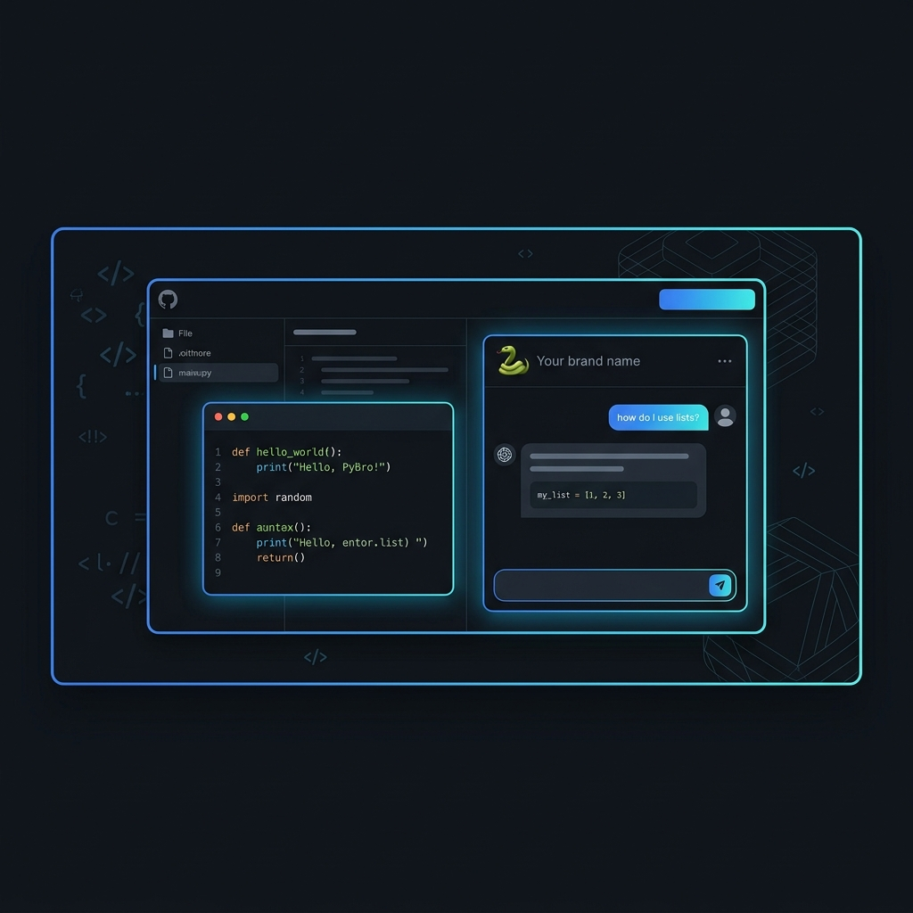

<div align="center">



# 🐍 PyBro Tutor

### _Python from scratch, bro!_

An AI-powered interactive Python tutor that teaches you Python like a friendly, knowledgeable bro — with real code examples, quizzes, and conversational learning.

[](https://python-tutor-nu.vercel.app/)
[](https://react.dev/)
[](https://vitejs.dev/)
[](https://ai.google.dev/)
[](https://vercel.com/)

[](https://github.com/LAKSHMANAN-O7O5/python-tutor/stargazers)
[](https://github.com/LAKSHMANAN-O7O5/python-tutor/network)
[](https://github.com/LAKSHMANAN-O7O5/python-tutor/issues)
[](LICENSE)

---

**[🚀 Live Demo](https://python-tutor-nu.vercel.app/)** · **[📦 Report Bug](https://github.com/LAKSHMANAN-O7O5/python-tutor/issues)** · **[✨ Request Feature](https://github.com/LAKSHMANAN-O7O5/python-tutor/issues)**

</div>

---

## 📖 About

**PyBro Tutor** is an AI-powered Python learning companion built for beginners who want to learn Python the fun way — through conversation. Powered by **Google's Gemini 3.5 Flash**, PyBro acts as your coding buddy, explaining concepts with simple analogies, real code examples, and interactive quizzes after every topic.

> _"Python Marandha? No problem bro!"_ — PyBro 🐍

---

## ✨ Features

<table>
<tr>
<td width="50%">

### 🎯 Topic-Based Learning
Pick from **8 core Python topics** — from Variables to OOP — and get structured, beginner-friendly lessons with code examples.

### 🤖 AI-Powered Conversations
Powered by **Gemini 3.5 Flash** — ask follow-up questions, request more examples, or dive deeper into any concept.

### 🧠 Built-in Quizzes
Every lesson ends with a quiz question to test your understanding before moving on.

### 💾 Auto-Saved Progress
Your conversation history persists across sessions — close the app, come back later, and resume where you left off.

</td>
<td width="50%">

### 📋 One-Click Code Copy
All code blocks come with a copy button for easy use — paste directly into your editor and run.

### 🎨 GitHub Dark Theme
A sleek, developer-friendly dark interface inspired by GitHub's dark mode — easy on the eyes for long learning sessions.

### ⚡ Rate Limit Handling
Smart retry logic with exponential backoff ensures smooth operation even on Gemini's free tier.

### 📱 Fully Responsive
Works beautifully on desktop, tablet, and mobile — learn Python anywhere.

</td>
</tr>
</table>

---

## 🗂️ Topics Covered

| Icon | Topic | What You'll Learn |
|:----:|-------|-------------------|
| 📦 | **Variables & Data Types** | `int`, `float`, `str`, `bool` — the building blocks |
| 🔤 | **Strings** | Indexing, slicing, `upper()`, `lower()`, `split()`, `replace()` |
| 📋 | **Lists & Tuples** | Mutable vs immutable, `append()`, `remove()`, slicing |
| 🗂️ | **Dictionaries** | Key-value pairs, creating, accessing, looping |
| 🔀 | **If / Else** | Conditional logic with real-world examples |
| 🔁 | **Loops** | `for` loops, `while` loops, `range()` usage |
| ⚙️ | **Functions** | `def`, parameters, return values, default arguments |
| 🏗️ | **OOP & Classes** | Classes, `__init__`, `self`, attributes, methods |

---

## 🛠️ Tech Stack

<div align="center">

| Technology | Purpose |
|:----------:|:--------|
|  **React 19** | UI framework with hooks |
|  **Vite 8** | Lightning-fast build tool |
|  **Gemini 3.5 Flash** | AI-powered responses |
|  **Vercel** | Serverless deployment |
|  **Serverless Functions** | Secure API proxy |

</div>

---

## 🏗️ Architecture

```
python-tutor/
├── api/
│   └── gemini/
│       └── index.js          # Vercel serverless function (Gemini proxy)
├── public/
│   ├── banner.png             # README banner
│   ├── favicon.svg            # App favicon
│   └── icons.svg              # UI icons
├── src/
│   ├── App.jsx                # Main app — topics, chat, AI integration
│   ├── App.css                # Component styles
│   ├── index.css              # Global styles & design tokens
│   └── main.jsx               # React entry point
├── .env                       # API key (not committed)
├── vercel.json                # Vercel routing config
├── vite.config.js             # Vite + Gemini dev proxy
└── package.json               # Dependencies & scripts
```

---

## 🚀 Getting Started

### Prerequisites

- **Node.js** 18+ installed
- A **Google Gemini API Key** — [Get one free here](https://aistudio.google.com/apikey)

### Installation

```bash
# 1. Clone the repo
git clone https://github.com/LAKSHMANAN-O7O5/python-tutor.git
cd python-tutor

# 2. Install dependencies
npm install

# 3. Create your environment file
echo "GEMINI_API_KEY=your_api_key_here" > .env

# 4. Start the dev server
npm run dev
```

The app will be running at `http://localhost:5173` 🎉

### Deploy to Vercel

1. Push your code to GitHub
2. Import the repo on [vercel.com](https://vercel.com/new)
3. Add `GEMINI_API_KEY` as an environment variable in Vercel settings
4. Deploy — Vercel auto-detects Vite and the `/api` serverless functions

---

## ⚙️ Environment Variables

| Variable | Description | Required |
|:---------|:------------|:--------:|
| `GEMINI_API_KEY` | Google Gemini API key for AI responses | ✅ |

---

## 🤝 Contributing

Contributions make the open-source community awesome! Any contributions you make are **greatly appreciated**.

1. **Fork** the project
2. **Create** your feature branch → `git checkout -b feature/amazing-feature`
3. **Commit** your changes → `git commit -m "Add amazing feature"`
4. **Push** to the branch → `git push origin feature/amazing-feature`
5. **Open** a Pull Request

---

## 📄 License

Distributed under the **MIT License**. See `LICENSE` for more information.

---

## 🙌 Acknowledgements

- [Google Gemini AI](https://ai.google.dev/) — For the powerful language model
- [React](https://react.dev/) — For the brilliant UI framework
- [Vite](https://vitejs.dev/) — For the blazing-fast dev experience
- [Vercel](https://vercel.com/) — For seamless serverless deployment

---

<div align="center">

**Built with ❤️ and 🐍 by [Lakshmanan](https://github.com/LAKSHMANAN-O7O5)**

⭐ Star this repo if PyBro helped you learn Python!

[](https://star-history.com/#LAKSHMANAN-O7O5/python-tutor&Date)

</div>
